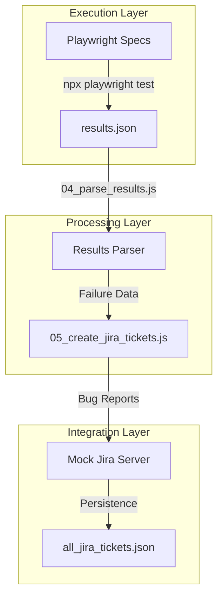

# STLC Automation Pipeline with Playwright & Jira

This project demonstrates a complete **Software Testing Life Cycle (STLC)** automation pipeline. It integrates Playwright for test execution, a custom results parser, and an automated Jira ticket creation system using a local mock Jira server.

## Project Architecture



## Features
- **Automated Web Testing**: Comprehensive test suite using Playwright.
- **Custom Reporting**: Generates HTML and JSON reports.
- **Result Parsing**: Extracts failed test details, error messages, and stack traces.
- **Jira Integration**: Automatically creates bug tickets for every failure.
- **Enhanced Ticket Logic**: Dynamic priority assignment and date-based labeling.
- **Mock Jira Server**: Standalone local server to simulate Jira REST API endpoints.

## Getting Started

### 1. Prerequisites
- Node.js (v18+)
- Playwright browsers installed (`npx playwright install`)

### 2. Execution Steps

#### Step 1: Run Automation Tests
Execute the Playwright test suite to generate initial results:
```bash
npx playwright test
```

#### Step 2: Parse Test Results
Analyze the `results.json` generated in Step 1:
```bash
node stlc_project/mcp_scripts/04_parse_results.js
```

#### Step 3: Start the Mock Jira Server
Run the local Jira server to receive ticket creation requests:
```bash
node stlc_project/jira_mock/jira_mock_server.js
```

#### Step 4: Create Jira Tickets
Run the ticket creation script (Standard or Enhanced):
```bash
# Standard Version
node stlc_project/mcp_scripts/05_create_jira_tickets.js

# Enhanced Version (with Categories & Date Labels)
node stlc_project/mcp_scripts/06_create_jira_tickets_enhanced.js
```

#### Step 5: Verify Tickets
Retrieve all created tickets via the mock server's API:
```bash
curl http://localhost:3001/rest/api/2/search | json_pp
```

## Project Structure
- **/stlc_project/tests**: Contains the Playwright `.spec.js` test files.
- **/stlc_project/mcp_scripts**: Automation scripts for parsing and Jira integration.
- **/stlc_project/jira_mock**: Local mock server implementation and Jira API client.
- **/stlc_project/reports**: Output directory for test results and HTML reports.
- **playwright.config.js**: Main configuration for Playwright execution.

---
*Created as part of the STLC Automation & Playwright MCP Training.*
